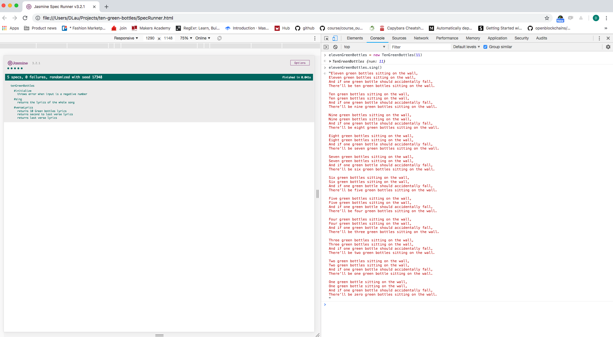

## Ten Green Bottles
A Simple Kata challenge to mimic the popular nursery rhyme to re-cap on my JavasScript knowledge.

I used a predefined method to convert numbers into words in strings using the below link:

 https://ourcodeworld.com/articles/read/353/how-to-convert-numbers-to-words-number-spelling-in-javascript


## Launch and Test
  clone repo
  `git clone https://github.com/dct-lau17/ten-green-bottles-kata.git`

  run code on browser console using SpecRunner.html
  `open SpecRunner.html`

  open console cmd + alt + i (on Mac) to view tests and run application

### Commands
```
threeGreenBottles = new TenGreenBottles(3) //create new instance
threeGreenBottles.sing() //prints out lyrics
```

### Example


